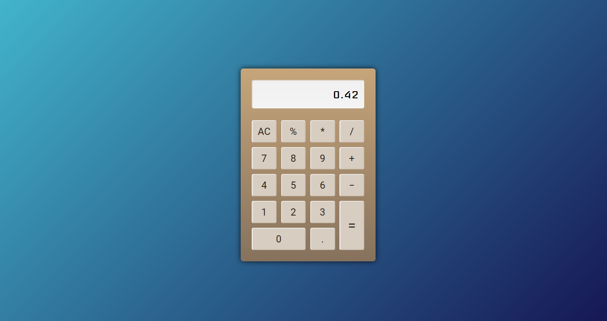

# Lógica de Programação com Javascript
Exercícios do curso "Lógica de Programação com Javascript" da Udemy  
https://www.udemy.com/logica-de-programacao-com-javascript-iniciando-no-frontend/
    
     
     
### Desafio: Calculadora

- [x] Operações simples (adição, subtr, multipl, divisão)
- [x] Botão para limpar display (AC)
- [x] Evita a limitação nativa do Javascript de lidar com decimais[(*)](http://adripofjavascript.com/blog/drips/avoiding-problems-with-decimal-math-in-javascript.html) através de 'scaling'
- [x] Cálculo percentual
- [x] Aceita input do teclado, tornando-se mais acessível (não fazia parte do desafio proposto, mas *why not?*)
    
Veja o resultado na prática, com todas as funcionalidades implementadas até agora, clicando no printscreen:  
  

Apesar de também não faz parte do desafio, seria muito legal limitar — eventualmente — em 10 ou 12 o número de dígitos que aparecem no display. De forma que 1,66666666666666(...) fosse arredondado para 1,6666666667 e números como 9438752390437765 dessem erro por serem grandes demais. Então fica aí a observação, para implementação futura.

